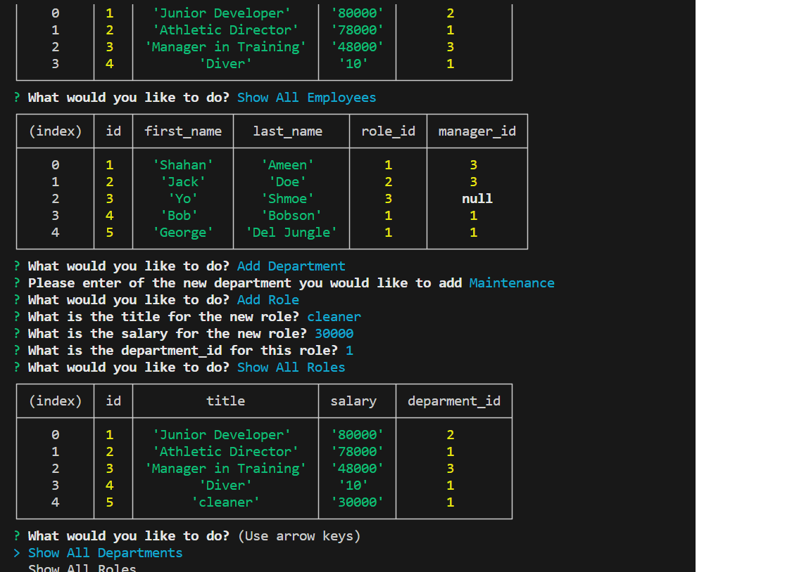

# Business-SQL

## description
In this assignment I've demonstarted on how to properly store data for this company. This important data kept track of of roles, departments, and employees. I had to create files in order for the data to communicate to each other, such as db folder which had my scheema and seeds sql to store data. As well as a connections.js file to connect mysql onto the file. 

## application img'

## URL
https://github.com/ShahanAmeen/Business-SQL
 
https://shahanameen.github.io/Business-SQL/ 
## Author
Shahan Ameen
https://github.com/ShahanAmeen 
